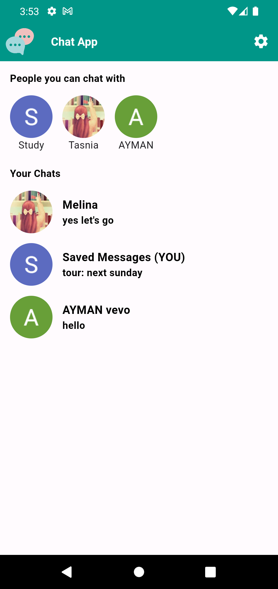

# Chat App - The ultimate way to connect people

<table>
  <tr>
    <td>
       
    <p>
    A simple chat app using firebase and flutter. We're using Firebase Authentication (Sign In with Google), Firebase Messaging & Local Notification for Push Notification and Firestore Database as user and chat database.
    </p>
    </td>

  </tr>
</table>
<table>
  <tr>
     <td>Splash Screen</td>
     <td>Sign In Screen</td>
     <td>Chat Screen</td>
     <td>Thread Screen</td>
      <td>Settings Screen</td>
  </tr>
  <tr>
    <td></td>
    <td></td>
    <td></td>
    <td></td>
    <td></td>
  </tr>
 </table>

## Database Design:

```
To ensure a secure messaging and data retrieval
We are using prime numbers to indicate a user.
When a user is authenticated in our app, we set a prime number as a key to their profile. We also track the last used prime number to get the next prime number so that every user's keys are unique.

Now to save & get the chats for two individual users, we simply multiply both keys together. Multiplication of both keys is the document ID for the chat.
```

## Project Environment:

```
Flutter 3.19.6 • channel stable • https://github.com/flutter/flutter.git
Framework • revision 54e66469a9 (10 weeks ago) • 2024-04-17 13:08:03 -0700
Engine • revision c4cd48e186
Tools • Dart 3.3.4 • DevTools 2.31.1
```

## Code Flow:

Project is following MVC pattern. For managing state We are using Riverpod. All the UI components are inside views folder. Business logic is handled inside controller folder. Model is used to parse data.

```
‣ lib
  ‣ src
    ‣ common_widgets
    ‣ constants
    ‣ features
      ‣ authentication
      ‣ chat
      ‣ settings
    ‣ routing
    ‣ utils
```

## Feature List

```
├── Sign in using Google Sign In
├── Get People List
├── Chat with people
├── Get notifications on chat
└── Logout
```

To learn more about riverpod:<br>
https://riverpod.dev/<br>
To Install flutter:<br>
https://flutter.dev/docs/get-started/install
